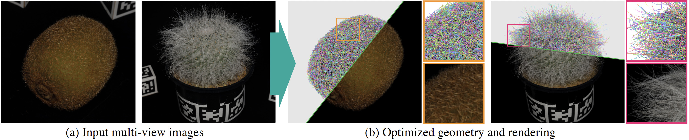
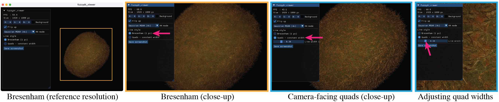

# Inverse Rendering for Modeling with Line Primitives

<p align="center">
  
</p>

[Kenji Tojo](https://kenji-tojo.github.io/),
[Ariel Shamir](https://faculty.runi.ac.il/arik/site/index.html),
[Nobuyuki Umetani](https://cgenglab.github.io/en/authors/admin/),
[Bernd Bickel](https://berndbickel.com/about-me)<br>
*SIGGRAPH Asia 2026 / ACM Transactions on Graphics*

[Project](https://kenji-tojo.github.io/sa26-line-primitives/) |
[Paper](https://kenji-tojo.github.io/sa26-line-primitives/resources/sa26_lines_paper.pdf) |
[Dataset](https://huggingface.co/datasets/kenji-tojo/fuzzy_dataset) |
[YouTube](https://www.youtube.com/watch?v=BTQmIC_yEkU)

## BibTeX

```bibtex
@article{tojo2026lines,
    author = {Tojo, Kenji and Shamir, Ariel and Umetani, Nobuyuki and Bickel, Bernd},
    title = {Inverse Rendering for Modeling with Line Primitives},
    year = {2026},
    issue_date = {December 2026},
    publisher = {Association for Computing Machinery},
    volume = {45},
    number = {6},
    url = {https://doi.org/10.1145/3842527},
    doi = {10.1145/3842527},
    journal = {ACM Trans. Graph.},
    month = dec,
    articleno = {200},
    numpages = {13}
}
```

---

## Setup

This project requires Python >= 3.10, an NVIDIA GPU, the [Vulkan SDK](https://vulkan.lunarg.com/sdk/home), and the CUDA Toolkit.

Create and activate a Python virtual environment:

```bash
python3 -m venv venv
source venv/bin/activate
```

Install [PyTorch](https://pytorch.org/get-started/locally/) with CUDA support according to your CUDA version. For example:

```bash
pip3 install torch torchvision
```

Install the [`fuzzydr`](https://github.com/kenji-tojo/fuzzydr) differentiable rasterizer following the [FuzzyDR installation instructions](https://github.com/kenji-tojo/fuzzydr#installation). This usually consists of the following three commands:

```bash
source /path/to/VulkanSDK/<version>/setup-env.sh
git clone https://github.com/kenji-tojo/fuzzydr external/fuzzydr
pip3 install -v external/fuzzydr/
```

Install the remaining dependencies:

```bash
pip3 install -r requirements.txt
```

---

## Datasets

All datasets are stored under `datasets/`, which is ignored by Git.

### Fuzzy Dataset

[Our real-world capture dataset](https://huggingface.co/datasets/kenji-tojo/fuzzy_dataset) is available through Hugging Face. Use `scripts/fetch_data.py` to download it into `datasets/fuzzy_dataset/`:

```bash
python scripts/fetch_data.py train        # training data, 4.3 GB
python scripts/fetch_data.py checkpoints  # released line models, 7.3 GB
```

Existing files are skipped, so interrupted downloads can be resumed by running the command again.

* The `train` mode downloads 1/4-resolution masked and unmasked reference images with camera transforms for all eight scenes, together with the coarse geometry used for primitive initialization.

* The `checkpoints` mode downloads our released line models (for both the Fuzzy and Shelly datasets) to preview the results without training. *We recommend starting with this*.

Large anonymous downloads may hit Hugging Face rate limits. To use a [Hugging Face read token](https://huggingface.co/docs/hub/en/security-tokens), put it on a single line in `datasets/HF_TOKEN.txt`.

Instead of the batch download above, the training script can fetch individual scenes. For example:

```bash
python scripts/train_fuzzy.py --scene dinosaur --useall
```

This fetches the `dinosaur` data and the coarse geometry needed for initialization, then starts training.

The complete Fuzzy dataset is approximately 50 GB and also includes full-resolution captures and additional data used for dataset processing. It is **not required** to run the experiments in this repository. To download it:

```bash
python scripts/fetch_data.py all
```

See the [dataset README](https://huggingface.co/datasets/kenji-tojo/fuzzy_dataset) for more details.

### Shelly Dataset

The [Shelly dataset](https://research.nvidia.com/labs/toronto-ai/adaptive-shells/) is third-party data and is not redistributed or automatically downloaded by this repository. Download and extract it so that each scene is located at `datasets/shelly_data_release/<scene>/`, where `<scene>` is one of `fernvase`, `horse`, `khady`, `kitten`, `pug`, or `woolly`.

---

## Running

You can reproduce our training using the scripts in `scripts/`:

```bash
bash scripts/run_fuzzy.sh
bash scripts/run_shelly.sh
```

These run our line primitive optimization for all scenes in the corresponding dataset and save the results under `./results/<run>`.

The Fuzzy dataset provides a train/test split, but our paper results use all captured photographs together to illustrate the maximum reconstruction quality achievable from the available observations. For controlled measurement and comparison, we use the Shelly dataset and train on its training split as usual. See the [Fuzzy dataset documentation](https://huggingface.co/datasets/kenji-tojo/fuzzy_dataset) for more details about the split.

Although the line-only setting gives the highest overall reconstruction quality for these fuzzy geometries, we also provide code for our ablation configurations, primarily to support future extensions using other primitive types or different discrete topology update strategies. These are provided in `scripts/baselines/` and can be run similarly:

```bash
bash scripts/baselines/run_shelly_triangles.sh
bash scripts/baselines/run_shelly_mcmc_reloc.sh
```

See [our paper](https://kenji-tojo.github.io/sa26-line-primitives/) for more details about these ablation cases.

A single scene can be run directly:

```bash
python scripts/train_shelly_lines.py --scene khady
python scripts/train_fuzzy.py --scene dinosaur --useall
```

### Multi-GPU Systems

This project is primarily intended for single-GPU systems. See FuzzyDR's [Multi-GPU Systems section](https://github.com/kenji-tojo/fuzzydr#multi-gpu-systems) for notes on running with multiple GPUs.

On a two-GPU system we tested, setting the following environment variables before running the training scripts makes the setup behave as a single-GPU environment:

```bash
export CUDA_VISIBLE_DEVICES=0
export FUZZYDR_DEVICE_INDEX=1
```

Note that the corresponding CUDA and Vulkan device indices may differ across systems.

### Reproducibility

Our differentiable renderer is not bit-deterministic: atomic reductions in the backward pass and PyTorch's internal seeding make exact reproduction challenging. In our tests, per-scene fluctuations are confined to the last printed digit, and every averaged score reproduces the value reported in the paper after rounding.

---

## Interactive Viewer

To use the interactive viewer, install FuzzyDR's optional viewer package:

```bash
pip3 install -v external/fuzzydr/viewer/
```

After fetching the released `checkpoints` (see the Datasets section), you can launch the viewer with the `kiwi` scene:

```bash
python scripts/viewer/view.py
```

You can specify an input checkpoint path to view other scenes or models from your own training.

### Viewer UI

<p align="center">
  
</p>

Although the 1-pixel-wide Bresenham lines are robust and stable during optimization (see the paper for details), their line structure becomes visible under large magnification. At runtime, we also provide an option to render the optimized line primitives as camera-facing quad sprites with a world-space radius. You can toggle between the two modes in the viewer and adjust the quad radius for the desired appearance.

### Web Viewer

We also provide a web viewer using [three.js](https://threejs.org/) to view the results in a browser.

First, convert the checkpoints to the web format (only once):

```bash
python web/precompute.py
```

Then launch the server and open the URL shown in the terminal:

```bash
python web/serve.py
```

### Benchmarking

Along with the viewer, we provide a script for benchmarking rendering speed (FPS) with different anti-aliasing modes:

```bash
bash scripts/viewer/run_benchmark.sh
```

---

## Troubleshooting

If you encounter missing files required to run the provided scripts, unexpected behavior, bugs, or need any clarification, please do not hesitate to contact the first author, [Kenji Tojo](https://kenji-tojo.github.io/).

Please also refer to FuzzyDR's [Gotcha section](https://github.com/kenji-tojo/fuzzydr#gotcha) for a note on gradient accumulation over multiple views.
